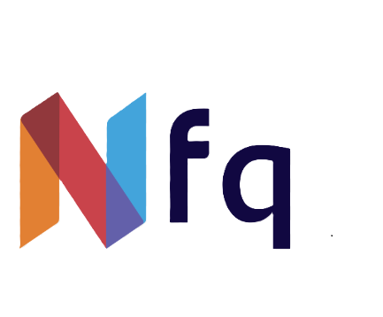

#  El Candidato Perfecto
## PResentación y documentación técnica

<div align="center">
    
</div>


## Descripción de la Aplicación
**IA Recruiter** es una innovadora aplicación basada en Inteligencia Artificial que revoluciona el proceso de selección de talento. Diseñada para ayudar a empresas y reclutadores a encontrar al candidato ideal, la aplicación analiza y clasifica automáticamente un conjunto de perfiles profesionales para determinar cuáles se ajustan mejor a una vacante específica.

---

## 🌟 Funcionalidades Clave

### 🔍 Análisis y Clasificación de Candidatos
- Evaluación de **20 CVs** proporcionados, utilizando algoritmos de IA Generativa para identificar el grado de adecuación de cada perfil a una vacante.
- Generación de un **ranking** basado en criterios semánticos y cuantitativos.

### 📄 Procesamiento de Vacantes
- Recepción de la descripción detallada del puesto y las preferencias del hiring manager.
- Análisis profundo de los requisitos del puesto para una mejor correspondencia con los candidatos.

### ⚖️ Cumplimiento Normativo y Ético ---> COMPLETAR
- Implementación de filtros y principios éticos para garantizar una selección justa y transparente.
- Consideración de regulaciones vigentes en el uso de IA para la contratación.

### 📊 Generación de Reportes y Visualización de Datos
- Representación visual de los resultados del ranking para facilitar la toma de decisiones.
- Análisis detallado del por qué cada candidato ha sido clasificado en determinada posición.

### ☁️ Desafío Extra: Integración con Google Drive
- Automatización del proceso de importación de CVs directamente desde Google Drive.
- Optimización del flujo de trabajo y reducción de errores manuales en la gestión de datos.

---

## Beneficios de la Aplicación
- ⏳ **Ahorro de tiempo** en la selección de candidatos.
- 🎯 **Mayor precisión** en la identificación del talento adecuado.
- 🔍 **Transparencia y equidad** en el proceso de reclutamiento.
- ☁️ **Fácil integración** con herramientas de almacenamiento en la nube.

---

## Público Objetivo
- 🏢 Empresas y departamentos de Recursos Humanos.
- 🕵️‍♂️ Agencias de reclutamiento y selección de personal.
- 👩‍💼 Profesionales que buscan optimizar procesos de contratación con IA.

**IA Recruiter** es la solución definitiva para empresas que buscan optimizar su proceso de selección con tecnología avanzada. 🚀


---

# Documentación Técnica del Sistema de Análisis de RRHH

## Arquitectura del Sistema

### Componentes Principales

1. **hr_analysis_system.py**
   - Contiene la lógica de negocio principal y las estructuras de datos
   - Componentes clave:
     - Modelos de datos (`JobProfile`, `CandidateProfile`, `MatchScore`)
     - Interfaz `IEmbeddingProvider` e implementación `OpenAIEmbeddingProvider`
     - Clase base `TextAnalyzer` con cálculo de similitud semántica
     - `SemanticAnalyzer` para procesamiento de texto usando OpenAI
     - `MatchingEngine` para la lógica de coincidencia candidato-trabajo
     - `RankingSystem` para clasificación de candidatos

2. **app.py**
   - Punto de entrada principal de la aplicación
   - Integra todos los componentes
   - Maneja el flujo de la aplicación y la interacción del usuario
   - Componentes:
     - Clase `HRAnalysisApp` coordinando todas las operaciones
     - Función principal asíncrona gestionando el ciclo de vida de la aplicación

3. **frontend/**
   - Componentes de UI y estilos
   - Componentes:
     - Clase `UIComponents` gestionando todos los elementos de UI
     - Estilizado CSS personalizado
     - Estructuras de datos de entrada/salida (`WeightSettings`, `UIInputs`)

4. **utils/**
   - Funciones de utilidad y ayudantes
   - Componentes:
     - `FileHandler` para operaciones con archivos
     - Utilidades comunes para formateo y procesamiento de datos
     - Configuración de registro

## Flujo de Datos

1. **Procesamiento de Entrada**
   ```
   Entrada Usuario -> FileHandler -> SemanticAnalyzer -> Perfiles Estandarizados
   ```
   - Se cargan la descripción del trabajo y los CVs
   - Los archivos son procesados por FileHandler
   - El texto es analizado y estructurado por SemanticAnalyzer 
   - Produce objetos estandarizados JobProfile y CandidateProfile

2. **Proceso de Coincidencia**
   ```
   Perfiles -> MatchingEngine -> MatchScore
   ```
   - Los perfiles se comparan usando similitud semántica
   - Se verifican los criterios eliminatorios si se proporcionan
   - Se calculan las puntuaciones por componente (habilidades, experiencia, educación)
   - Se generan las puntuaciones finales de coincidencia

3. **Proceso de Clasificación**
   ```
   MatchScores -> RankingSystem -> Resultados Clasificados
   ```
   - Los candidatos se ordenan según puntuaciones de coincidencia
   - Se identifican los candidatos descalificados
   - Los resultados se formatean para visualización

4. **Visualización**
   ```
   Resultados Clasificados -> UIComponents -> Interfaz de Usuario
   ```
   - Los resultados se convierten a DataFrame
   - Se aplican estilos basados en puntuaciones
   - Se crean elementos interactivos
   - La visualización final se presenta al usuario

## Configuración

El sistema utiliza un módulo de configuración central (`config.py`) con los siguientes componentes:

1. **ModelConfig**
   - Configuración del modelo LLM
   - Configuración del modelo de embeddings

2. **MatchingConfig**
   - Umbrales de coincidencia
   - Distribuciones de peso por defecto

3. **DisplayConfig**
   - Configuración de visualización UI
   - Esquemas de color
   - Límites de vista previa

## Estructura de Pruebas

El conjunto de pruebas está organizado en los siguientes componentes:

1. **Pruebas Unitarias**
   - `test_semantic_analyzer.py`: Pruebas para análisis de texto
   - `test_matching_engine.py`: Pruebas para lógica de coincidencia
   - `test_ranking_system.py`: Pruebas para funcionalidad de clasificación
   - `test_file_handler.py`: Pruebas para operaciones con archivos
   - `test_utilities.py`: Pruebas para funciones de utilidad

2. **Configuración de Pruebas**
   - `conftest.py`: Fixtures compartidos de prueba
   - `pyproject.toml`: Configuración de pruebas y cobertura

## Dependencias

Las dependencias clave están organizadas por funcionalidad:

1. **Procesamiento Principal**
   - streamlit: Framework de UI
   - pandas: Manipulación de datos
   - numpy: Operaciones numéricas

2. **IA/ML**
   - openai: LLM y embeddings

3. **Manejo de Archivos**
   - PyPDF2: Procesamiento de PDF
   - aiofiles: Operaciones de archivo asíncronas

4. **Pruebas**
   - pytest: Framework de pruebas
   - pytest-asyncio: Soporte de pruebas asíncronas
   - pytest-cov: Informes de cobertura

## Manejo de Errores

El sistema implementa un manejo integral de errores:

1. **Operaciones de Archivo**
   - Tipos de archivo inválidos
   - Problemas de codificación
   - Errores de extracción PDF

2. **Operaciones de API**
   - Errores de API de OpenAI
   - Limitación de tasa
   - Problemas de conexión

3. **Errores de Procesamiento**
   - Datos de entrada inválidos
   - Fallos de análisis
   - Errores de puntuación

4. **Errores de UI**
   - Validación de entrada
   - Formateo de visualización
   - Gestión de estado

## Consideraciones de Rendimiento

1. **Operaciones Asíncronas**
   - Lectura de archivos asíncrona
   - Llamadas API no bloqueantes
   - UI permanece responsiva

2. **Gestión de Recursos**
   - Uso eficiente de memoria
   - Manejo apropiado de archivos
   - Agrupación de conexiones

3. **Optimización**
   - Caché de embeddings
   - Procesamiento por lotes donde sea posible
   - Operaciones eficientes con DataFrame